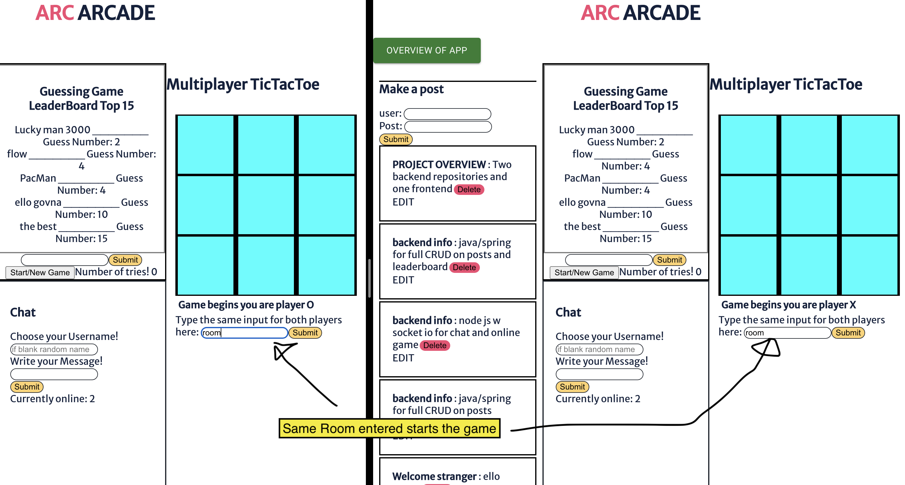
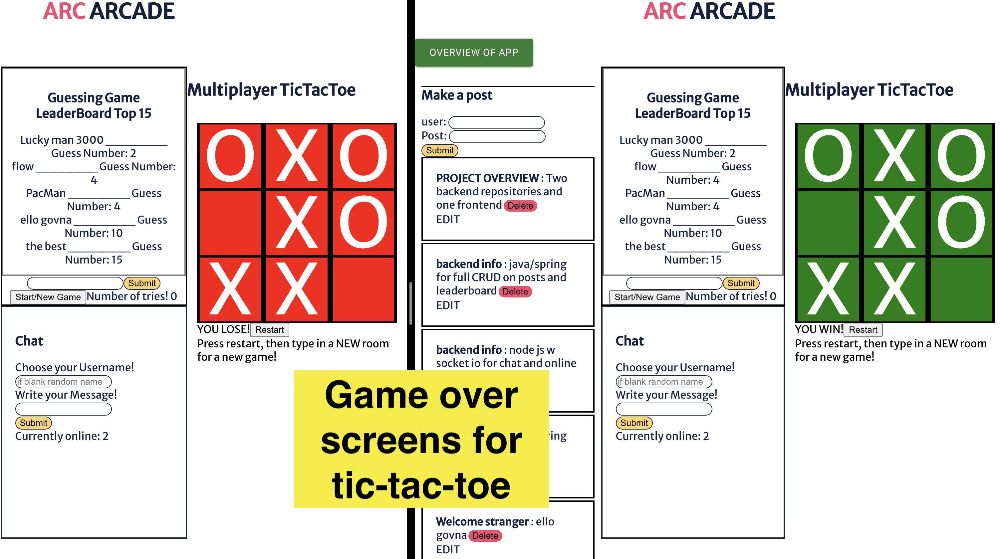

# READ ME

## Project built by Darwood Antoine

## OverView: 
[ARC Arcade](https://murmuring-bayou-78293.herokuapp.com/). An app where people can play online games, instant message , make/edit/delete posts, and post high scores in games they've played.
It consists of three parts: The front-end (this repository) with a [java spring back-end](https://github.com/kidwizard42/final-project-social-media-server-java-spring) and a [node js back-end](https://github.com/kidwizard42/final-project-social-media-server-socket).

### Note:
App is deployed on heroku so the first run of the site can take up to 30 seconds to load

## FEATURES:

### LOADING SCREEN:  
  A loading screen while the data on the java spring back end is fetched.

### ONLINE TIC TAC TOE
  Two player ONLINE tic-tac-toe (two different computers, browers, tabs etc). Both players must enter the same room to play. Once two people are in a room the game will begin. The board is updated automatically on each move. You are unable to update the game board when it is not your turn. When one person wins the game the board both boards will update to refelect if they won or lost.  See pictures below for reference.
  
  ### tic-tac-toe Game start
  
  
  ### tic-tac-toe Game over
  
  
### POSTS
  Full CRUD for posts using java/spring boot. Feel free to make your own or edit another
  
### CHAT
  Instant messaging! Use with a friend's laptop or open another tab/browser. Keeps track of how many people are online. You can either pick a name or leave   that input blank for a random name.

### GUESSING GAME
  feature is purely here to have an auto updating high score board. Guess a number from 1-10. Like arcade games, if you are in the top 15 of scores you can put your name and it will automatically update the leaderboard!

